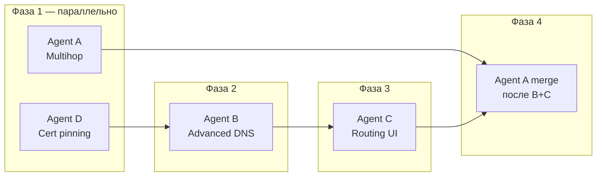

# P2 — Advanced security & routing — распределение работы между агентами

> **Для пользователя (кратко):** P2 разбит на **четыре потока** (три обязательных + один опциональный). **Agent D** (cert pinning) и **Agent A** (multihop) можно запускать **параллельно** с минимальными конфликтами. **Agent B** (DNS) и **Agent C** (routing UI) трогают общий config pipeline — рекомендуется **последовательный merge B → C** или жёсткое разделение файлов (`dns_config_builder.dart` / `routing_config_builder.dart`). **Multihop (A)** merge **после B и C** — меняет outbounds и теги proxy.
>
> Рекомендуемый порядок merge в `main`: **D → B → C → A** (D опционален и может идти в любой момент).
>
> Зависимости P0/P1 (уже выполнены): auto-reconnect, geo fail-closed, server picker, RU direct preset (`ConfigEnhancer`), secure SOCKS injection, kill switch plumbing.

---

## Overview

| Agent | ID | Branch | Mission | Параллельность |
|-------|-----|--------|---------|----------------|
| **A** | Multihop | `cursor/multihop-chains-5a8f` | Double VPN / цепочки outbounds (xray chain, sing-box detour) | Параллельно с **D**; merge после **B+C** |
| **B** | Advanced DNS | `cursor/advanced-dns-5a8f` | DoH/DoT, custom DNS, leak protection (TUN), leak test | Параллельно с **D** и **A** (осторожно с `profile.dart`); merge **до C** |
| **C** | Custom Routing UI | `cursor/custom-routing-ui-5a8f` | Визуальный редактор правил, import/export, merge с подпиской | Параллельно с **D**; merge **после B** |
| **D** *(optional)* | Security hardening | `cursor/subscription-cert-pinning-5a8f` | Certificate pinning для fetch подписок | Полностью изолирован |

**Почему 4 потока:** DNS и routing UI оба меняют JSON перед connect, но разные секции (`dns` / `routing`/`route`). Multihop — отдельная ось (outbounds). Cert pinning — только HTTP fetch.

---

## Agent A — Multihop (Double VPN / chains)

**Branch:** `cursor/multihop-chains-5a8f`

### Scope (`tasks.md` → P2 → Multihop)

- [ ] Chain model — 2+ outbounds (xray `proxySettings` chain / sing-box `dialer` + `detour`)
- [ ] UI — выбор 2-го (и далее) hop из списка серверов подписки
- [ ] Validation — несовместимые протоколы, таймауты, порядок detour
- [ ] Docs — latency vs anonymity tradeoff

### Files / areas

| Layer | Paths |
|-------|-------|
| Models | `secure_vpn_client/lib/models/multihop_chain.dart` *(new)*, `lib/models/profile.dart` (`multihopEnabled`, `hopServerIndices`) |
| Config | `lib/utils/multihop_config_builder.dart` *(new)*, `lib/utils/config_enhancer.dart` (вызов builder), `lib/utils/link_config_builder.dart` (теги outbounds) |
| Services | `lib/services/vpn_service.dart` (`resolveProfileConfig` — сборка 2+ серверов из подписки) |
| UI | `lib/widgets/multihop_picker_tile.dart` *(new)*, `lib/screens/home_screen.dart` или `config_screen.dart` |
| Tests | `test/multihop_config_builder_test.dart` *(new)* |
| Docs | `docs/en/multihop.md`, `docs/ru/multihop.md` *(new)* |

### Dependencies

| Dependency | Source | Blocking? |
|------------|--------|-----------|
| Server list API | `VpnService.listSubscriptionServers` / `ServerPickerTile` | No — уже есть |
| Outbound tag normalization | `ConfigParser._normalizeXraySubscriptionConfig` | No — переиспользовать `proxy` tag |
| DNS / routing agents | B, C | **Soft** — merge после B+C чтобы не ломать порядок `ConfigEnhancer` |
| Geo / censorship presets | P1 Agent C | No |

### Acceptance criteria

- [ ] Профиль с 2 hop: трафик идёт server1 → server2 → internet (xray + sing-box fixtures)
- [ ] UI: toggle multihop + picker 2-го сервера (только subscription с ≥2 серверами)
- [ ] Validation: запрет chain на `direct`/`block`, несовместимые протоколы (напр. wireguard как промежуточный hop — явная ошибка)
- [ ] Secure SOCKS inbound не затронут; credentials per-session сохранены
- [ ] `flutter analyze` + `flutter test` green
- [ ] RU/EN docs с предупреждением о latency

### Security constraints

- Multihop не открывает дополнительных listen-портов
- Не логировать UUID/пароли hop-серверов
- Chain не должен обходить `injectSecureSocksInbound`

---

## Agent B — Advanced DNS

**Branch:** `cursor/advanced-dns-5a8f`

### Scope (`tasks.md` → P2 → Advanced DNS)

- [ ] DNS leak protection — принудительный DNS через туннель в TUN mode
- [ ] DoH / DoT — настраиваемый encrypted DNS upstream в UI
- [ ] Custom DNS — user resolvers (IP, DoH URL, DoT host)
- [ ] DNS leak test — встроенная проверка или ссылка из Settings
- [ ] Desktop proxy mode — документировать отличия DNS vs full VPN

### Files / areas

| Layer | Paths |
|-------|-------|
| Models | `lib/models/dns_settings.dart` *(new)* — `DnsMode`, `DnsUpstream` (udp/doh/dot) |
| Providers | `lib/providers/dns_settings_provider.dart` *(new)* |
| Config | `lib/utils/dns_config_builder.dart` *(new)*, `lib/utils/config_parser.dart` (`_ensureSingboxRemoteDns` — расширить, не дублировать), `lib/utils/link_config_builder.dart` (sing-box DNS block) |
| Services | `lib/services/dns_leak_probe.dart` *(new)* — HTTP check через tunnel / сравнение resolver |
| UI | `lib/screens/settings_screen.dart` (секция Advanced → DNS), `lib/widgets/dns_settings_card.dart` *(new)* |
| Native (TUN) | `packages/v2ray_box/ios/PacketTunnel/PacketTunnelProvider.swift`, `android/.../VPNService.kt` — align system DNS with tunnel when leak protection on |
| Tests | `test/dns_config_builder_test.dart`, `test/dns_settings_test.dart` *(new)* |
| Docs | `docs/en/dns.md`, `docs/ru/dns.md` *(new)*; дополнить `docs/en/mobile_vpn_config.md` |

### Current baseline (уже есть)

- `ConfigParser._migrateSingboxLegacyDns` + `_ensureSingboxRemoteDns` — UDP 8.8.8.8 / 1.1.1.1, strip `local`, `default_domain_resolver`
- `LinkConfigBuilder._buildSingbox` — bootstrap DNS для Android TUN
- iOS `PacketTunnelProvider` — `NEDNSSettings` 8.8.8.8
- Нет UI, нет DoH/DoT picker, нет leak test

### Dependencies

| Dependency | Source | Blocking? |
|------------|--------|-----------|
| Kill switch TUN | P1 Agent A | No — документировать совместное поведение |
| sing-box ≥1.12 DNS schema | `troubleshooting.md` | No — следовать существующей миграции |
| Routing UI | Agent C | **Soft** — DNS tags могут использоваться в route rules; merge B before C |

### Acceptance criteria

- [ ] Settings: режим DNS (default / custom / encrypted) + список upstream
- [ ] TUN mode: при включённой leak protection все DNS-запросы через tunnel config (`detour: proxy` для DoH где применимо; **не** `detour: direct` на sing-box ≥1.12)
- [ ] Desktop proxy mode: disclaimer «DNS не перехватывается системой» + ссылка на docs
- [ ] Leak test: кнопка в Settings → результат без утечки секретов
- [ ] Unit tests: DoH URL → sing-box `type: https`; DoT → `type: tls`
- [ ] `flutter analyze` + `flutter test` green

### Security constraints

- DoH/DoT через proxy outbound, не через неаутентифицированный localhost
- Leak test не отправляет subscription URL / credentials
- Не персистить DNS пароли (если появятся)

---

## Agent C — Custom Routing UI

**Branch:** `cursor/custom-routing-ui-5a8f`

### Scope (`tasks.md` → P2 → Custom routing UI)

- [ ] Rule editor — domains, IP/CIDR, geo (geosite/geoip) без raw JSON
- [ ] Import/export — routing rules как отдельный профиль
- [ ] Presets — «blocked sites only», «RU direct / rest proxy» (расширить существующий `ruDirectRouting`)
- [ ] Merge — user rules с routing из подписки

### Files / areas

| Layer | Paths |
|-------|-------|
| Models | `lib/models/routing_rule.dart` *(new)*, `lib/models/routing_profile.dart` *(new)* |
| Providers | `lib/providers/routing_profile_provider.dart` *(new)* |
| Config | `lib/utils/routing_config_builder.dart` *(new)*, `lib/utils/config_enhancer.dart` (рефактор: `_applyRuDirectRouting` → preset), `lib/utils/config_parser.dart` (geo guard — уже есть) |
| UI | `lib/screens/routing_editor_screen.dart` *(new)*, `lib/screens/settings_screen.dart` (ссылка Advanced → Routing) |
| Tests | `test/routing_config_builder_test.dart`, `test/routing_profile_test.dart` *(new)* |
| Docs | `docs/en/routing_rules.md`, `docs/ru/routing_rules.md` *(new)* |

### Current baseline (уже есть)

- `ConfigEnhancer._applyRuDirectRouting` — preset RU direct (P1)
- `Profile.ruDirectRouting` + censorship wizard toggle
- `ConfigParser.configRequiresXrayGeoRules` + fail-closed в `VpnService`
- Subscription routing preserved in `ConfigParser` (sanitize only on inbound removal)
- **Нет** визуального редактора, import/export, merge UI

### Dependencies

| Dependency | Source | Blocking? |
|------------|--------|-----------|
| Geo assets | `scripts/fetch_cores.sh` | No — reuse fail-closed |
| RU direct preset | P1 | No — мигрировать в preset registry |
| DNS settings | Agent B | **Yes (recommended)** — merge после B если rules ссылаются на DNS |
| Multihop | Agent A | No — разные секции config |

### Acceptance criteria

- [ ] CRUD routing rules в UI (domain, ip_cidr, geosite, geoip → outbound tag)
- [ ] Import/export JSON routing profile (отдельно от VPN profile)
- [ ] Presets: «Blocked only», «RU direct» (паритет с `ruDirectRouting`)
- [ ] User rules **prepend** к subscription rules (не replace); unit test на merge order
- [ ] Geo rules без assets → fail closed с понятной ошибкой
- [ ] Desktop proxy mode disclaimer в docs
- [ ] `flutter analyze` + `flutter test` green

### Security constraints

- Direct outbound rules не открывают SOCKS без auth
- Import validation — reject rules pointing to removed inbound tags
- No bypass via `127.0.0.0/8` в user rules без review

---

## Agent D — Security hardening (optional)

**Branch:** `cursor/subscription-cert-pinning-5a8f`

### Scope (`tasks.md` → P2 → Security hardening)

- [ ] Certificate pinning для subscription fetch

### Files / areas

| Layer | Paths |
|-------|-------|
| Config / HTTP | `lib/utils/subscription_http_client.dart` *(new)*, `lib/utils/config_parser.dart` (`fetchSubscriptionBody`) |
| Models | `lib/models/pinning_config.dart` *(new)* — SPKI hashes per host |
| Providers | `lib/providers/pinning_provider.dart` *(new)* |
| UI | `lib/screens/settings_screen.dart` — Advanced → Security (opt-in toggle + manage pins) |
| Tests | `test/subscription_pinning_test.dart` *(new)* — mock `http.Client` |
| Docs | `docs/en/security.md` — раздел pinning limitations |

### Dependencies

- **Нет** — изолирован от A/B/C

### Acceptance criteria

- [ ] Opt-in pinning (default off) — не ломает сторонние подписки
- [ ] Pin по SPKI hash; понятная ошибка при mismatch
- [ ] `PanelManager` HTTP **не** затронут без явного scope (или отдельная задача)
- [ ] Tests с mock certificates
- [ ] Документировать риск: panel rotation cert → user must update pin

---

## Матрица параллелизации

|  | A Multihop | B DNS | C Routing | D Pinning |
|--|:---:|:---:|:---:|:---:|
| **A** | — | ⚠️ profile | ✅ | ✅ |
| **B** | ⚠️ | — | ⚠️ pipeline | ✅ |
| **C** | ✅ | ⚠️ | — | ✅ |
| **D** | ✅ | ✅ | ✅ | — |

**Легенда:** ✅ — параллельно без блокировки · ⚠️ — возможны конфликты в `profile.dart`, `config_enhancer.dart` · merge order снижает риск

### Рекомендуемый порядок выполнения

**Практика:** Agent A может начать model/UI рано, но **финальный merge multihop** — после B+C. Agent D — в любой момент.

### Снижение конфликтов merge

1. **Не расширять `Profile` монолитно** — вынести `DnsSettings`, `RoutingProfileRef`, `MultihopChain` в отдельные persisted keys (`shared_preferences`).
2. **Единая точка сборки:** `ConfigPipeline.apply(profile, json, engine)` вызывает `DnsConfigBuilder` → `RoutingConfigBuilder` → `MultihopConfigBuilder` → `ConfigEnhancer` (legacy mux/fingerprint).
3. Каждый агент владеет **своим** builder-файлом.

---

## Риски и блокеры

| Риск | Impact | Mitigation |
|------|--------|------------|
| Конфликты в `profile.dart` / `config_enhancer.dart` | High | Отдельные models + `ConfigPipeline`; merge order D→B→C→A |
| sing-box DNS `detour: direct` fatal | High | Следовать `troubleshooting.md`; тесты на ≥1.12 schema |
| Desktop proxy DNS leak «не фиксится» | Medium | Честные docs; leak test показывает platform limits |
| Multihop + subscription tag rewrite | Medium | Нормализовать tags (`proxy`, `hop-1`, `hop-2`) в builder |
| Cert pinning ломает панели с Let's Encrypt rotation | Medium | Opt-in only; docs |
| Geo rules без assets | Low | Уже fail-closed — reuse |
| iOS TUN DNS hijack | Medium | Координация B с `PacketTunnelProvider` |

---

## Чеклист обновления `tasks.md`

После merge каждого агента отметить соответствующие `[ ]` в секции **P2 — Advanced security & routing** и обновить матрицу Feedback → status.

---

*Создано: 2026-09-04 — координация P2 для RioNexTunnel.*
