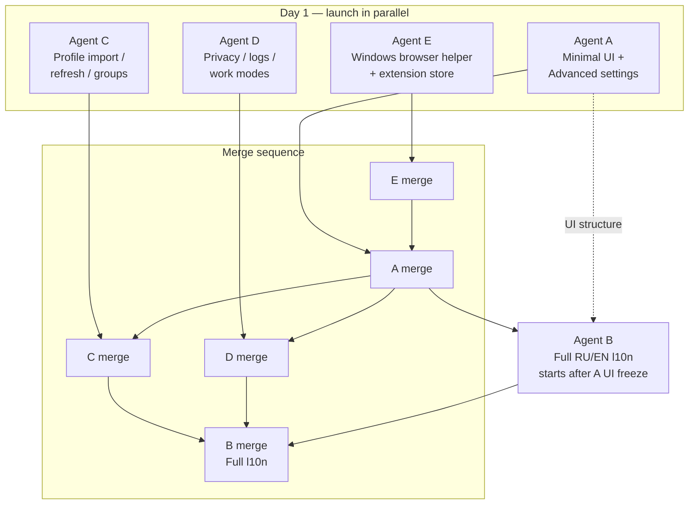

# P3 — UX, transparency & competitive edge — agent distribution

> **For the coordinator (short):** P3 is split into **five parallel workstreams**. **Agent E** (Windows browser helper + extension store) is **fully isolated** and can start day 1. **Agent A** (minimal Home + Advanced settings screen) should merge **first** among Dart UI agents — it reshapes navigation. **Agent C** (profiles: clipboard/QR, refresh, groups) and **Agent D** (transparency + work modes) can run in parallel after A’s screen split is defined (coordinate on `settings_screen.dart`). **Agent B** (full RU/EN l10n) should merge **last** — it sweeps all user-visible strings after UI structure stabilizes.
>
> Recommended merge order into `main`: **E → A → C → D → B**.
>
> **P0–P2 dependencies (completed):** connection states/stats, server picker, multihop, DNS/routing UI, kill switch, split tunnel, censorship presets, panel MVP, secure SOCKS, Linux browser helper.

---

## Current state vs P3 requirements

| P3 item | Status | Notes |
|---------|--------|-------|
| Connect in 1–2 taps | ⚠️ Partial | `ConnectionButton` on Home; profile pick still on Profiles tab |
| Advanced settings screen | ❌ Missing | Kill switch, DNS, routing, split tunnel, pinning, censorship all in flat `SettingsScreen` |
| Full RU/EN localization | ⚠️ Partial | `*Strings` helpers for proxy/browser/panel only; ~90% hardcoded English |
| Dark/light + system theme | ✅ Done | `themeModeProvider`, `AppTheme.light/dark`, default `ThemeMode.system` |
| Clipboard / QR import | ❌ Missing | Reference in `packages/v2ray_box/example/` (`mobile_scanner`, clipboard menu) |
| Subscription auto-refresh | ❌ Missing | Manual refresh in `ServerPickerTile`; panel `refreshConfig` only |
| Server groups / favorites | ❌ Missing | `SubscriptionManager.groupServers` is transport-stack grouping, not user tags |
| Privacy policy doc | ❌ Missing | Zero-telemetry stated in README/tasks only |
| User log viewer | ⚠️ Partial | `AppLog` writes files; Settings shows path + copy — no in-app viewer or Debug level |
| VPN vs Proxy work modes | ⚠️ Partial | `VpnService` sets `VpnMode.proxy`/`vpn` by platform; no user override or unified docs |
| Windows browser helper | ❌ Missing | `get_browser_helper_status` returns all `false` on Windows |
| Extension store publish | ❌ Missing | Local load only; docs in `extensions/secure-vpn-proxy-auth/` |

---

## Overview

| Agent | ID | Branch | Mission | Parallel with |
|-------|-----|--------|---------|---------------|
| **A** | Minimal UI shell | `cursor/minimal-ui-advanced-5a8f` | Home 1–2 tap connect; separate Advanced settings; theme polish | E (day 1); C/D after screen split agreed |
| **B** | Localization | `cursor/full-l10n-ru-en-5a8f` | `flutter gen-l10n` RU/EN for entire app | E only until A merges |
| **C** | Profile management | `cursor/profile-import-refresh-5a8f` | Clipboard/QR import, scheduled refresh, tags/favorites | E, D; soft wait on A for Home profile chip |
| **D** | Transparency & modes | `cursor/transparency-work-modes-5a8f` | Privacy policy, log viewer, VPN/Proxy mode switch + docs | E, C |
| **E** | Desktop browser platform | `cursor/windows-browser-helper-5a8f` | Windows native messaging; extension store publish prep | All (native + extensions only) |

**Why 5 streams:** UI shell (A) and l10n (B) conflict if done simultaneously on the same files. Profile features (C) and transparency (D) are separate domains with light overlap. Browser platform work (E) is native/C++ and store metadata — zero Dart overlap.

---

## Agent A — Minimal UI & Advanced settings

**Branch:** `cursor/minimal-ui-advanced-5a8f`

### Owned checklist (`tasks.md` → P3 → Minimal UI)

- [ ] Connect in 1–2 taps — Home: profile + prominent Connect button
- [ ] Advanced settings screen — routing, DNS, kill switch, split tunnel grouped separately
- [ ] Dark/light theme aligned with system preference *(verify/polish — largely done)*

### Files / areas

| Layer | Paths |
|-------|-------|
| Navigation | `lib/main.dart` (`MainShell` — optional 4th tab or Settings → Advanced entry) |
| Home | `lib/screens/home_screen.dart` — profile quick-picker sheet/chip; keep `ConnectionButton` primary |
| New screen | `lib/screens/advanced_settings_screen.dart` *(new)* |
| Settings trim | `lib/screens/settings_screen.dart` — move sections to Advanced; keep Appearance, Core engine, Diagnostics link, Panel |
| Widgets moved | `kill_switch_card.dart`, `dns_settings_card.dart`, `subscription_pinning_card.dart`, split-tunnel block, censorship block, `browser_helper_card.dart` (or keep on Settings for desktop — document choice) |
| Providers | `lib/providers/vpn_providers.dart` — no model changes expected |
| Tests | `test/home_screen_test.dart` *(new widget test)*, `test/advanced_settings_navigation_test.dart` *(new)* |

### Dependencies

| Dependency | Source | Blocking? |
|------------|--------|-----------|
| P2 settings widgets | done | No — reuse as-is |
| Profile list API | `profilesProvider`, `selectedProfileProvider` | No |
| Agent B l10n | B | No — English strings OK; B migrates after merge |
| Agent C profile chip | C | **Soft** — agree on `ProfileQuickPicker` widget API |

### Suggested implementation order

1. Create `AdvancedSettingsScreen`; move existing `_SectionCard` blocks (kill switch, DNS, routing, censorship, pinning, split tunnel) without logic changes
2. Settings: single ListTile “Advanced” → `Navigator.push(AdvancedSettingsScreen)`
3. Home: tappable profile row / FAB sheet listing profiles + “Add profile” shortcut; selecting updates `selectedProfileProvider`
4. Verify connect flow: select profile on Home → tap Connect (≤2 taps when profile exists)
5. Theme: confirm `ThemeMode.system` default in `ThemeModeNotifier`; add visual regression note in PR
6. Widget tests for navigation and profile selection

### Acceptance criteria

- [ ] User can switch active profile and connect from Home without opening Profiles tab (2 taps max when ≥1 profile exists)
- [ ] Settings shows only “essentials”; advanced security/routing/DNS/kill switch live under Advanced
- [ ] No regression: all P2 cards still reachable and functional
- [ ] `flutter analyze` + `flutter test` green
- [ ] No new telemetry; no credential display changes

### Security constraints

- Home profile picker must not show config links or SOCKS secrets
- Advanced screen must not weaken kill-switch or SOCKS auth UX

---

## Agent B — Full localization (RU/EN)

**Branch:** `cursor/full-l10n-ru-en-5a8f`

### Owned checklist (`tasks.md` → P3 → Minimal UI)

- [ ] Full app localization (RU/EN) beyond proxy/browser helper strings

### Files / areas

| Layer | Paths |
|-------|-------|
| l10n setup | `pubspec.yaml` (`flutter: generate: true`), `l10n.yaml` *(new)*, `lib/l10n/app_en.arb`, `lib/l10n/app_ru.arb` |
| App root | `lib/main.dart` — `localizationsDelegates`, `supportedLocales`, locale provider |
| Provider | `lib/providers/locale_provider.dart` *(new)* — persist `Locale` in SharedPreferences |
| Screens | `home_screen.dart`, `config_screen.dart`, `settings_screen.dart`, `advanced_settings_screen.dart`, `routing_editor_screen.dart`, `censorship_wizard_screen.dart`, `per_app_proxy_screen.dart` |
| Widgets | Migrate `proxy_credentials_card.dart`, `browser_helper_card.dart`, `panel_*`, `socks_auth_mode_strings.dart` → ARB keys |
| Settings UI | Language selector (System / English / Русский) in Appearance section |
| Tests | `test/l10n_smoke_test.dart` *(new)* — load both locales, pump key screens |
| Docs | `docs/en/localization.md`, `docs/ru/localization.md` *(new, brief)* |

### Dependencies

| Dependency | Source | Blocking? |
|------------|--------|-----------|
| Agent A screen split | A | **Recommended** — merge A first to avoid double-moving strings |
| Agent C/D new strings | C, D | **Soft** — rebase B after C+D or accept follow-up PR |

### Suggested implementation order

1. Add `flutter gen-l10n` + `l10n.yaml`; generate `AppLocalizations`
2. Add `localeProvider` + Settings language picker (follow device locale when “System”)
3. Migrate screens in order: `main.dart` → Home → Config → Settings → Advanced → widgets
4. Delete redundant `*Strings` static classes after ARB migration
5. Smoke tests for EN + RU on Home and Settings

### Acceptance criteria

- [ ] All user-visible strings in main app use `AppLocalizations` (no hardcoded English in `lib/screens/` / `lib/widgets/`)
- [ ] RU and EN ARB files kept in sync (same keys)
- [ ] System locale respected when language = System
- [ ] Existing RU strings for proxy/browser/panel preserved or improved
- [ ] `flutter analyze` + `flutter test` green

### Security constraints

- ARB files must not contain real credentials, tokens, or subscription URLs
- Error messages must not embed raw SOCKS passwords from exceptions

---

## Agent C — Profile management

**Branch:** `cursor/profile-import-refresh-5a8f`

### Owned checklist (`tasks.md` → P3 → Profile management)

- [ ] Profile import from clipboard / QR (`vless://`, `trojan://`, etc.)
- [ ] Scheduled subscription auto-refresh + manual refresh
- [ ] Server groups — tags, favorites, last used

### Files / areas

| Layer | Paths |
|-------|-------|
| Model | `lib/models/profile.dart` — `tags`, `isFavorite`, `lastUsedAt`, `subscriptionRefreshInterval`, `lastSubscriptionFetchAt` |
| Services | `lib/services/subscription_refresh_service.dart` *(new)* — timer / foreground refresh; `lib/services/profile_import_service.dart` *(new)* — clipboard + QR parse |
| Providers | `lib/providers/vpn_providers.dart` (`ProfilesNotifier` extensions), `lib/providers/subscription_refresh_provider.dart` *(new)* |
| UI | `lib/screens/config_screen.dart` — import actions; `lib/screens/profile_import_sheet.dart` *(new)*; `lib/widgets/profile_list_tile.dart` *(new)* — favorite star, tags chips |
| Home (coordination) | `lib/screens/home_screen.dart` — optional favorite profiles section if Agent A adds quick picker |
| QR | `pubspec.yaml` — `mobile_scanner` (mirror example); `lib/screens/qr_scan_screen.dart` *(new)* |
| Tests | `test/profile_import_service_test.dart`, `test/subscription_refresh_service_test.dart`, `test/profile_tags_test.dart` |
| Docs | `docs/en/profiles.md`, `docs/ru/profiles.md` *(new)* |

### Dependencies

| Dependency | Source | Blocking? |
|------------|--------|-----------|
| `V2rayBox.isValidConfigLink` | existing | No |
| `ConfigParser.parseFromUrl` | existing | No — reuse for subscription refresh |
| Censorship wizard | P1 | No — optional post-import wizard |
| Agent A Home picker | A | **Soft** — import can land on Config first |

### Suggested implementation order

1. Extend `Profile` JSON schema + migration defaults for new fields
2. `ProfileImportService`: clipboard read, multi-link paste, `vless://`/`vmess://`/`trojan://` validation
3. QR scan screen (mobile/desktop camera where supported; desktop: paste fallback)
4. `SubscriptionRefreshService`: manual refresh action on subscription profiles; periodic refresh (e.g. 6h/12h/24h/off) via `Timer` while app running + refresh on app resume
5. UI: tags editor, favorite toggle, sort by last used / favorites
6. Unit tests for import parsing and refresh scheduling (fake async)

### Acceptance criteria

- [ ] Import from clipboard creates profile(s) through existing censorship wizard path when enabled
- [ ] QR scan adds valid link profile on Android/iOS (desktop: document camera limitation or use file picker)
- [ ] Subscription profiles: manual Refresh + configurable auto-refresh interval; stale indicator in UI
- [ ] Favorites and tags persist; “last used” updates on successful connect
- [ ] Invalid links show non-blocking error; no crash on malformed QR
- [ ] `flutter analyze` + `flutter test` green

### Security constraints

- Imported links stored as today (SharedPreferences) — document in privacy policy (Agent D)
- Refresh uses existing `SubscriptionHttpClient` + opt-in cert pinning
- QR/clipboard content never logged at INFO level

---

## Agent D — Transparency & work modes

**Branch:** `cursor/transparency-work-modes-5a8f`

### Owned checklist (`tasks.md` → P3)

**Transparency:**
- [ ] Privacy policy doc — zero telemetry, what is stored locally
- [ ] User-facing log viewer (no credentials); Info / Debug levels
- [ ] Keep this file synced with releases / GitHub Issues *(process — each P3 PR updates `tasks.md`)*

**Work modes:**
- [ ] VPN Mode (TUN) — mobile: full tunnel, kill switch, split tunnel
- [ ] Proxy Mode — desktop: system proxy + browser extension; document kill switch limits
- [ ] Unified mode switch — auto-detect per platform with power-user override

### Files / areas

| Layer | Paths |
|-------|-------|
| Model | `lib/models/service_mode_preference.dart` *(new)* — `auto`, `proxy`, `vpn` |
| Provider | `lib/providers/service_mode_provider.dart` *(new)* |
| Service | `lib/services/vpn_service.dart` — respect override in `setServiceMode` call |
| Logging | `lib/services/app_log.dart` — `LogLevel` enum, debug filter, `readTail()` for viewer |
| UI | `lib/screens/log_viewer_screen.dart` *(new)*, `lib/screens/privacy_policy_screen.dart` *(new)* or in-app WebView/markdown |
| Settings | `lib/screens/settings_screen.dart` — Diagnostics: “View logs”, “Privacy policy”; Work mode selector |
| Docs | `docs/en/privacy.md`, `docs/ru/privacy.md`, `docs/en/work_modes.md`, `docs/ru/work_modes.md` |
| Process | `.cursor/tasks.md` — checkbox updates per merged agent PR |

### Dependencies

| Dependency | Source | Blocking? |
|------------|--------|-----------|
| Kill switch / split tunnel | P1 | No — document behavior per mode |
| Agent A Advanced screen | A | **Soft** — log viewer link can live in Settings Diagnostics until A merges |
| Platform `VpnMode` | `v2ray_box` | No — already exposed |

### Suggested implementation order

1. Draft `docs/en/privacy.md` + `docs/ru/privacy.md` (local storage, no telemetry, panel opt-in, log files)
2. `AppLog`: add `debug()` behind level flag; `readRecentLines()` with credential scrubbing
3. `LogViewerScreen`: searchable list, level filter, export/share without secrets
4. `ServiceModePreference`: auto = current platform heuristic; override persisted
5. Settings segmented control + platform disclaimers (desktop proxy kill-switch limits)
6. Work modes docs cross-linking `kill_switch.md`, `browser_extension.md`, `mobile_vpn_config.md`

### Acceptance criteria

- [ ] Privacy policy accessible in-app and in `docs/en|ru/privacy.md`
- [ ] Log viewer shows INFO+ by default; Debug opt-in in Settings; no credentials in displayed lines
- [ ] Work mode Auto/Proxy/VPN override persists; reconnect required on change
- [ ] Desktop Proxy + VPN override shows warning if unsupported (e.g. Windows TUN)
- [ ] Each implementing agent’s PR includes `tasks.md` checkbox updates
- [ ] `flutter analyze` + `flutter test` green

### Security constraints

- Log viewer must reuse `_looksLikeCredentialLeak` or stronger redaction
- Privacy doc must not claim telemetry that does not exist; panel stats upload described as opt-in only

---

## Agent E — Desktop browser helper & extension store

**Branch:** `cursor/windows-browser-helper-5a8f`

### Owned checklist (`tasks.md` → P3 → Other UX)

- [ ] Windows browser helper (native messaging host; Linux reference in `packages/v2ray_box/linux/`)
- [ ] Publish browser extension to Chrome Web Store / Firefox AMO

### Files / areas

| Layer | Paths |
|-------|-------|
| Windows native | `packages/v2ray_box/windows/native_messaging.{h,cpp}` *(new)*, `native_messaging_host.cpp` *(new)*, `v2ray_box_plugin.cpp` (`get_browser_helper_status`, `setup` install) |
| Windows CMake | `packages/v2ray_box/windows/CMakeLists.txt` |
| Shared headers | Port/adapt `packages/v2ray_box/linux/native_messaging_config.h` |
| Extension | `extensions/secure-vpn-proxy-auth/manifest.json` — store-ready version, icons, descriptions |
| Store assets | `extensions/secure-vpn-proxy-auth/store/` *(new)* — screenshots, promo text EN/RU |
| Docs | `docs/en/browser_extension.md`, `docs/ru/browser_extension.md`, `docs/en/windows_setup.md` — update Windows from “planned” to steps |
| CI note | Document manual store submission (no secrets in repo) |

### Dependencies

| Dependency | Source | Blocking? |
|------------|--------|-----------|
| Linux reference | `linux/native_messaging*.cc` | No — port patterns |
| Session credentials channel | P0 | No — already on Windows desktop |
| Dart UI | `browser_helper_card.dart` | No — works once status returns true |

### Suggested implementation order

1. Port native messaging host binary + registry manifests (Chrome/Edge/Firefox paths on Windows)
2. Wire `get_browser_helper_status` to real checks (host binary, manifest, extension detected where possible)
3. Invoke host install from `setup()` / first connect (mirror Linux)
4. Manual test: Windows + Chromium + extension → no 407 dialog
5. Prepare AMO + Chrome Web Store listings (unlisted or public — document owner account requirement)
6. Update extension README with store links when published

### Acceptance criteria

- [ ] Windows `get_browser_helper_status` reports accurate install state
- [ ] Native host receives session creds on connect; extension auth works on Chromium + Firefox
- [ ] No listen on `0.0.0.0`; credentials wiped on disconnect (parity with Linux)
- [ ] Store submission package documented (checklist, privacy justification, permissions narrative)
- [ ] `flutter analyze` + Windows build succeeds

### Security constraints

- Registry manifest paths must point to user-local host binary only
- Extension permissions minimal (`webRequestAuthProvider` / proxy only)
- Store listing must state: localhost-only authenticated proxy, no remote telemetry

---

## Parallelization matrix

| Workstream | Day 1 parallel | Must wait for | High-conflict files |
|------------|----------------|---------------|---------------------|
| **A** Minimal UI | E | — | `settings_screen.dart`, `home_screen.dart`, `main.dart` |
| **B** Localization | E | **A** (recommended) | All `lib/screens/`, `lib/widgets/` |
| **C** Profiles | E, (A soft) | — | `profile.dart`, `vpn_providers.dart`, `config_screen.dart` |
| **D** Transparency | E, C | A (soft) | `app_log.dart`, `settings_screen.dart`, `vpn_service.dart` |
| **E** Browser platform | All | — | `packages/v2ray_box/windows/*`, `extensions/*` only |

**Sequential couplings:**
- B ← A (UI structure before string sweep)
- C ↔ A (Home profile chip widget — agree interface early)
- D ↔ A (Advanced vs Settings placement for log viewer entry)

**Highly parallel (safe):**
- E + any Dart agent (different trees)
- C + D (mostly disjoint files; both touch `settings_screen.dart` — separate `_SectionCard`s only)

---

## Recommended merge order (into `main`)

```
1. cursor/windows-browser-helper-5a8f     (Agent E)  — isolated native; can merge first or last
2. cursor/minimal-ui-advanced-5a8f        (Agent A)  — navigation shell
3. cursor/profile-import-refresh-5a8f     (Agent C)  — profile model extensions
4. cursor/transparency-work-modes-5a8f    (Agent D)  — logs, privacy, mode switch
5. cursor/full-l10n-ru-en-5a8f            (Agent B)  — final string sweep
```

**Rebase rule:** Each agent rebases onto latest `main` before opening PR. Agent B rebases after A+C+D merge.

**Release:** After all five merge, tag `v0.9.0` (or next minor), update `tasks.md` P3 section to completed, add `docs/en/release_notes/v0.9.0.md`.

---

## Execution diagram



---

## Risks & conflict avoidance

| Risk | Impact | Mitigation |
|------|--------|------------|
| `settings_screen.dart` edited by A, B, D | High | A moves sections first; B only renames strings; D adds Diagnostics tiles only — no refactors |
| `profile.dart` growth | Medium | C owns new fields; document JSON schema in PR |
| l10n churn | High | Merge B last; Agents A/C/D use plain English until then |
| Windows native messaging AV false positives | Medium | Document code signing; host in `%LOCALAPPDATA%` |
| QR on desktop Linux | Low | Graceful fallback: “Paste from clipboard” |
| Subscription refresh battery drain | Medium | Default interval ≥6h; refresh on resume only when stale |
| Store review delays | Low | E delivers host + docs; store links can follow unlisted publish |

### Process rules

1. **No drive-by refactors** in shared files
2. **New screens in new files** (`advanced_settings_screen.dart`, `log_viewer_screen.dart`, etc.)
3. Each PR updates **P3 checkboxes** in `.cursor/tasks.md` for its scope
4. Run `flutter analyze` + `flutter test` before each PR
5. Native plugin changes → full restart required (note in PR body)

### Testing ownership

| Test type | Owner |
|-----------|-------|
| Home / navigation widget tests | A |
| l10n smoke tests | B |
| Import / refresh unit tests | C |
| Log redaction / mode preference tests | D |
| Windows manual browser auth | E |

---

## Launch checklist for parent coordinator

| # | Action |
|---|--------|
| 1 | Confirm P2 merged to `main` (v0.8.0) |
| 2 | Launch **E**, **A**, **C**, **D** in parallel |
| 3 | Launch **B** after Agent A opens PR (or after A merges) |
| 4 | Enforce merge order **E → A → C → D → B** |
| 5 | After all merges: Linux 4× connect matrix + `security_probe.sh`; Windows browser auth smoke test |
| 6 | Tag release + sync `tasks.md` + bilingual release notes |

---

*Created: 2026-09-04 — coordinates P3 workstreams for RioNexTunnel (planning only; implementation in child agent branches).*
