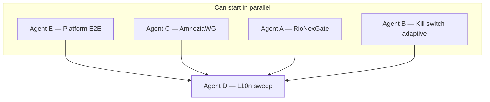

# P4 — Post-P3 backlog & platform hardening — agent distribution

> **For the coordinator (short):** P0–P3 are complete on `main` (v0.9.0). P4 closes the **four unchecked boxes** in `.cursor/tasks.md`, the **feedback-matrix gaps** (AmneziaWG, RioNexGate MVP partials), **l10n follow-up** from P3 Agent B, and **platform E2E** verification. Five parallel workstreams; **Agent E** (Windows/macOS desktop hardening) can start day 1. **Agent A** (RioNexGate) and **Agent C** (AmneziaWG) are isolated domains. **Agent B** (kill-switch adaptive) touches native mobile + `VpnService` — coordinate with A on `panel_providers.dart` / stats lifecycle only. **Agent D** (l10n sweep) merges **last**.
>
> Recommended merge order: **E → C → A → B → D**.

---

## Remaining work inventory (verified 2026-09-04)

### Unchecked `[ ]` in `tasks.md`

| Item | Section | Codebase status |
|------|---------|-----------------|
| Adaptive kill switch (per-app) | P1 Kill Switch | UI stub exists; `KillSwitchModeNotifier.setMode` **rejects** `adaptive`; native per-app block rules not wired |
| Linux TUN split tunnel | P1 Split Tunneling | **Out of scope** for current desktop proxy architecture; no TUN mode on Linux — defer to future TUN workstream |
| Panel stats 60s background flush | P1 RioNexGate §2.3 | `flushStats()` only on disconnect/register/refresh; **no periodic timer** while connected |
| Panel additive-uninstall docs | P1 RioNexGate §2.7 | No `docs/en|ru/panel_pairing.md`; `clearRegistration` removes RioNexGate profile only (manual profiles kept) — behavior undocumented |

### Partial / implicit backlog (marked done with caveats in `tasks.md`)

| Item | Notes |
|------|-------|
| Periodic panel config sync | Manual refresh + WS `refresh_config` only; **no scheduled sync** |
| Full panel JSON config apply | `syncConfig` caches JSON; connect path uses **subscription URL** profile + cached JSON only for SOCKS auth extraction |
| Panel `device_token` storage | Still **SharedPreferences**; tasks.md notes “migrate to secure storage later” |
| Panel pairing user docs (roadmap phase 4) | `rionexgate_testing.md` exists; no end-user pairing guide |
| AmneziaWG protocol | Classifier + fallback **ordering** only; **no** `awg://` parse, outbound build, or fixture tests |
| P3 l10n follow-up | ~30+ hardcoded English strings in `lib/screens/` (6 files) and `lib/widgets/` (8 files) |
| Platform E2E | `docs/en|ru/README.md` roadmap still unchecked; Android/iOS/Windows/macOS need device verification |
| macOS browser helper | `get_browser_helper_status` returns all `false` (stub) |
| Extension store publish | Submission package in `extensions/.../store/`; **manual** publish only |
| Windows build | CMake fix merged to `main` (PR #85 area); verify `flutter build windows` in CI/agent E |

### Explicitly deferred (not in P4 scope)

- **Linux TUN split tunnel** — conditional on adding Linux TUN mode; document as future work only
- **Extension store listing** — operational/manual; Agent E documents checklist, does not submit

---

## Overview

| Agent | ID | Branch | Mission | Parallel with |
|-------|-----|--------|---------|---------------|
| **A** | RioNexGate completion | `cursor/rionexgate-panel-completion-5a8f` | Stats timer, periodic sync, full JSON apply, secure token storage, pairing docs | C, E |
| **B** | Kill switch adaptive | `cursor/kill-switch-adaptive-5a8f` | Per-app adaptive block when core drops; wire UI + native | A (soft), E |
| **C** | AmneziaWG protocol | `cursor/amneziawg-protocol-5a8f` | AWG link parse, outbound JSON, fallback tests, docs | A, E |
| **D** | L10n secondary sweep | `cursor/l10n-secondary-sweep-5a8f` | ARB migration for remaining screens/widgets | E only until A/B/C merge |
| **E** | Platform E2E & desktop | `cursor/platform-e2e-hardening-5a8f` | macOS browser helper, parity checklist, Windows verify, E2E docs | All (native/docs) |

**Why 5 streams:** Panel (A), censorship protocol (C), and l10n (D) have zero file overlap. Kill switch (B) is mobile-native heavy. Platform (E) is mostly `packages/v2ray_box/macos/` + docs.

---

## Dependency graph

---

## Agent A — RioNexGate panel completion

**Branch:** `cursor/rionexgate-panel-completion-5a8f`

### Scope

Close RioNexGate roadmap **phases 2 & 4** partials and unchecked docs checkbox.

### Files / areas

| Layer | Paths |
|-------|-------|
| Panel service | `lib/services/panel_manager.dart` — periodic sync interval, stats sampling |
| Providers | `lib/providers/panel_providers.dart` — `Timer.periodic` ~60s stats flush while connected; lifecycle dispose |
| Connect pipeline | `lib/providers/panel_providers.dart` (`_upsertPanelProfile`), `lib/services/vpn_service.dart` — apply full cached/synced JSON when panel profile active |
| Config | `lib/utils/config_parser.dart` — panel JSON → engine config helper if needed |
| Storage | Add `flutter_secure_storage` (or platform channel) for `device_token`; keep cache in prefs |
| UI | `lib/widgets/panel_settings_section.dart` — optional sync interval setting |
| Docs | `docs/en/panel_pairing.md`, `docs/ru/panel_pairing.md` — additive integration, uninstall behavior, manual profiles preserved |
| Tests | `test/panel_manager_test.dart`, `test/panel_integration_test.dart` — periodic flush mock, JSON apply path |

### Dependencies

| Dependency | Blocking? |
|------------|-----------|
| Existing PanelManager MVP | No — extend |
| Agent B kill switch | No |
| Agent D l10n | No — English OK; D migrates strings after merge |

### Acceptance criteria

- [ ] While VPN connected and panel active, stats uploaded at ~60s intervals **and** on disconnect
- [ ] Scheduled config sync (default ≥15 min, configurable) with `config_hash` skip
- [ ] Panel profile connect uses full JSON config when server provides `config` object (subscription URL fallback unchanged)
- [ ] `device_token` stored in secure storage on Android/iOS; best-effort on desktop
- [ ] `docs/en|ru/panel_pairing.md` documents additive model; clearing panel registration does not delete manual profiles
- [ ] `flutter analyze` + `flutter test` green; no credentials in logs

### Security constraints

- Never log `device_token` or SOCKS passwords in stats payload
- Cached panel JSON on disk must not contain transport secrets in logs
- Secure storage wipe on `clearRegistration`

---

## Agent B — Kill switch adaptive (per-app)

**Branch:** `cursor/kill-switch-adaptive-5a8f`

### Scope

Implement deferred **Adaptive** kill switch: when core/tunnel drops, block only apps **not** in split-tunnel allow list (whitelist mode) or only apps in block list (blacklist mode) — per platform capabilities.

### Files / areas

| Layer | Paths |
|-------|-------|
| Dart | `lib/providers/kill_switch_provider.dart` — enable `setMode(adaptive)` |
| UI | `lib/widgets/kill_switch_card.dart` — remove “available after Agent B” stub; use l10n keys |
| Service | `lib/services/kill_switch_service.dart` — pass per-app package list to native |
| Split tunnel | `lib/providers/per_app_proxy_provider.dart`, `lib/models/split_tunnel_settings.dart` |
| Android | `packages/v2ray_box/android/.../V2rayBoxPlugin.kt`, VPN service — adaptive firewall rules |
| iOS | `packages/v2ray_box/ios/...` — document NE limitations if full per-app block impossible |
| Desktop | `packages/v2ray_box/linux|windows|macos/` — proxy-mode: document adaptive = strict (no per-app at OS level) or WFP/pf scoped rules |
| Tests | `test/kill_switch_adaptive_test.dart` *(new)*, extend `integration_test/` smoke |
| Docs | `docs/en/kill_switch.md`, `docs/ru/kill_switch.md` — adaptive vs strict vs proxy limits |

### Dependencies

| Dependency | Blocking? |
|------------|-----------|
| Per-app split tunnel UI (P1 Agent B) | No — done |
| Agent A panel stats | No |

### Acceptance criteria

- [ ] User can select **Adaptive** in Settings; mode persists
- [ ] On Android: simulated core crash blocks non-VPN apps per whitelist/blacklist; allowed apps reach direct network
- [ ] Desktop proxy mode: clear UX — adaptive degrades to strict or shows limitation banner
- [ ] Integration test: core crash → no leak for blocked apps (Linux strict path minimum)
- [ ] `tasks.md` adaptive checkbox marked done
- [ ] `flutter analyze` + `flutter test` green

### Security constraints

- Adaptive rules must not expose unauthenticated localhost SOCKS
- Kill switch rules removed on clean disconnect

---

## Agent C — AmneziaWG protocol support

**Branch:** `cursor/amneziawg-protocol-5a8f`

### Scope

Close feedback-matrix **AmneziaWG ❌ Missing**: parse AWG links, generate sing-box/xray outbound JSON (per upstream core capability), integrate with existing fallback chain.

### Files / areas

| Layer | Paths |
|-------|-------|
| Link builder | `lib/utils/link_config_builder.dart` — `awg://` / AmneziaWG param parsing |
| Parser | `lib/utils/config_parser.dart` — preserve AWG outbounds from full JSON subs |
| Classifier | `lib/utils/transport_stack_classifier.dart` — verify detection paths |
| Fallback | `lib/services/subscription_manager.dart`, `test/protocol_fallback_test.dart` — AWG in probe order |
| Scripts | `scripts/fetch_cores.sh` — document sing-box version gate for AWG if required |
| Fixtures | `test/fixtures/amneziawg_*.json` or link samples *(new)* |
| Tests | `test/amneziawg_config_test.dart` *(new)*, extend `censorship_transport_test.dart` |
| Docs | `docs/en/censorship_resistance.md`, `docs/ru/censorship_resistance.md` — AWG setup, operator-block fallback |

### Dependencies

| Dependency | Blocking? |
|------------|-----------|
| Official cores only (no fwflunky fork) | Policy — evaluate sing-box built-in AWG |
| Agent B/D | No |

### Acceptance criteria

- [ ] Sample `awg://` or tagged subscription entry round-trips to valid outbound JSON
- [ ] Fallback chain includes AmneziaWG when present in subscription (mock failure test)
- [ ] If core lacks AWG: graceful error + doc link (no crash)
- [ ] Feedback matrix AmneziaWG → ✅
- [ ] `flutter test` green

### Security constraints

- **No** unmaintained AmneziaWG core binaries — official sing-box/xray only
- SOCKS injection rules unchanged

---

## Agent D — Localization secondary sweep

**Branch:** `cursor/l10n-secondary-sweep-5a8f`

### Scope

P3 follow-up: migrate remaining hardcoded English in screens/widgets to `AppLocalizations`.

### Files / areas (priority)

| Layer | Paths |
|-------|-------|
| ARB | `lib/l10n/app_en.arb`, `lib/l10n/app_ru.arb` |
| Screens | `censorship_wizard_screen.dart`, `routing_editor_screen.dart`, `config_screen.dart`, `profile_import_sheet.dart`, `qr_scan_screen.dart`, `per_app_proxy_screen.dart` |
| Widgets | `kill_switch_card.dart`, `dns_settings_card.dart`, `multihop_picker_tile.dart`, `profile_list_tile.dart`, `profile_quick_picker.dart`, `server_picker_tile.dart` |
| Tests | `test/l10n_smoke_test.dart` — extend coverage |
| Docs | `docs/en/localization.md` — note completion |

### Dependencies

| Dependency | Blocking? |
|------------|-----------|
| Agents A, B, C, E UI changes | **Yes — merge D last** |

### Acceptance criteria

- [ ] No hardcoded user-visible English in listed screens/widgets (grep clean)
- [ ] EN/RU ARB keys in sync
- [ ] `flutter gen-l10n` + `flutter test` green
- [ ] Kill-switch adaptive strings from Agent B included if B merged first

---

## Agent E — Platform E2E & desktop hardening

**Branch:** `cursor/platform-e2e-hardening-5a8f`

### Scope

Device verification documentation, macOS browser helper parity, Windows build verification, platform parity checklist updates.

### Files / areas

| Layer | Paths |
|-------|-------|
| macOS native | `packages/v2ray_box/macos/Classes/V2rayBoxPlugin.swift` — port Linux/Windows browser helper pattern |
| macOS host | `packages/v2ray_box/macos/native_messaging/` *(new, mirror windows/linux)* |
| Docs | `docs/en/platform_parity_checklist.md`, `docs/ru/platform_parity_checklist.md` — E2E results template |
| Docs | `docs/en/macos_setup.md` — browser extension install |
| Docs | `docs/en/README.md`, `docs/ru/README.md` — E2E status |
| CI | `.github/workflows/ci.yml` — optional `flutter build windows` job if runner available |
| Extension | `extensions/secure-vpn-proxy-auth/store/SUBMISSION_CHECKLIST.md` — macOS host path note |

### Dependencies

| Dependency | Blocking? |
|------------|-----------|
| Windows CMake fix on `main` | No — already merged |
| Agent D | No |

### Acceptance criteria

- [ ] macOS `get_browser_helper_status` reports real install state (when host installed)
- [ ] `docs/en/platform_parity_checklist.md` includes macOS browser helper steps
- [ ] `flutter build windows` succeeds on CI or documented manual gate
- [ ] README roadmap E2E item updated with per-platform status table
- [ ] Linux TUN split tunnel documented as **future** (not implemented) in split-tunnel docs

### Security constraints

- Browser helper: `127.0.0.1` only; credentials via native messaging, not extension storage

---

## Recommended merge order

| Order | Branch | Rationale |
|-------|--------|-----------|
| 1 | `cursor/platform-e2e-hardening-5a8f` | macOS helper + docs; low Dart conflict |
| 2 | `cursor/amneziawg-protocol-5a8f` | Isolated `lib/utils/` + tests |
| 3 | `cursor/rionexgate-panel-completion-5a8f` | Panel providers; before B if B touches shared lifecycle |
| 4 | `cursor/kill-switch-adaptive-5a8f` | Native changes; UI strings picked up by D |
| 5 | `cursor/l10n-secondary-sweep-5a8f` | Final string sweep across all P4 UI |

**After all merges:** Linux 4× connect matrix + `security_probe.sh`; Android adaptive kill-switch device smoke; panel mock integration tests.

---

## Post-P4 / future (not assigned)

| Item | Notes |
|------|-------|
| Linux TUN mode + split tunnel | New epic; policy routing / cgroup |
| Extension store live listing | Manual Chrome AMO submit from `extensions/.../store/` |
| RioNexGate live docker E2E in CI | Optional; currently documented manual only |
| iOS PacketTunnel production entitlements | App Group / team ID for release |

---

## Launch checklist for parent coordinator

| # | Action |
|---|--------|
| 1 | Confirm `main` at v0.9.0+ with P3 merged |
| 2 | Launch **E**, **A**, **C** in parallel (day 1) |
| 3 | Launch **B** after E opens PR or in parallel if native owners differ |
| 4 | Hold **D** until A/B/C/E PRs are open (merge D last) |
| 5 | Enforce merge order **E → C → A → B → D** |
| 6 | Update `.cursor/tasks.md` checkboxes per agent PR |
| 7 | Tag v1.0.0-rc when P4 complete + device E2E sign-off |

---

*Generated: 2026-09-04 — consolidates remaining `tasks.md` items after P3 completion (#78–#83).*
