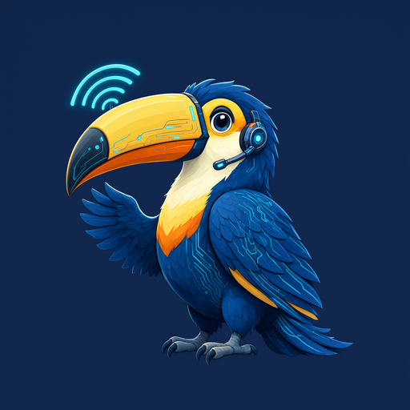

<p align="center">
  
</p>

<p align="right">
  <a href="README.md"></a>
</p>

# RioNexTunnel

**RIO — надёжная интернет-прослойка.** Кроссплатформенный VPN-клиент на Flutter с Xray-core и sing-box  
*Nexus + Tunnel — «связующий туннель» для конфигов и платформ.*  
*Защита от неавторизованного локального SOCKS5-прокси (март 2026)*

[](https://flutter.dev)
[](https://github.com/XTLS/Xray-core)
[](https://github.com/SagerNet/sing-box)
[](LICENSE)

---

## Описание

**RioNexTunnel** объединяет конфиги и платформы в защищённый канал. Приложение подключается к VPN-серверам по протоколам VLESS, VMess, Shadowsocks, Trojan, Hysteria/Hysteria2, TUIC, WireGuard, SSH и другим через ядра **Xray-core** и **sing-box**.

Создано на Flutter для **Android, iOS, Windows, Linux и macOS**.

---

## Документация

| Руководство | Описание |
|-------------|----------|
| [Быстрый старт](docs/ru/getting_started.md) | Клонирование, зависимости, ядра, запуск |
| [Настройка Linux](docs/ru/linux_setup.md) | Proxy mode, расширение браузера |
| [Настройка Android](docs/ru/android_setup.md) | VPN mode, manifest, jniLibs |
| [Настройка iOS](docs/ru/ios_setup.md) | Network Extensions, entitlements |
| [Архитектура](docs/ru/architecture.md) | Компоненты и поток данных |
| [Безопасность](docs/ru/security.md) | Модель SOCKS-аутентификации |
| [Расширение браузера](docs/ru/browser_extension.md) | Авто-авторизация прокси |
| [Устранение неполадок](docs/ru/troubleshooting.md) | Типичные ошибки и решения |
| [Участие в разработке](docs/ru/contributing.md) | Чеклист PR и пути правок |

Полный индекс: [docs/README.md](docs/README.md) · English: [docs/en/README.md](docs/en/README.md)

Для AI-агентов Cursor: [.cursor/AGENTS.md](.cursor/AGENTS.md)

---

## Быстрый старт

```bash
git clone https://github.com/RioTwWks/Secure-Cross-Platform-VPN-Client.git
cd Secure-Cross-Platform-VPN-Client
./scripts/fetch_cores.sh
cd secure_vpn_client
flutter pub get
flutter run -d linux    # или android, windows, macos, ios
```

Подробности: [docs/ru/getting_started.md](docs/ru/getting_started.md)

---

## Безопасность

- SOCKS5 только на `127.0.0.1`, **обязательная авторизация**, случайные учётные данные на сессию
- Нет привязки к `0.0.0.0`, нет незащищённого порта `7890`
- Учётные данные стираются при отключении; не логируются и не сохраняются

Полная модель: [docs/ru/security.md](docs/ru/security.md)

---

## Структура репозитория

```
├── secure_vpn_client/       # Flutter-приложение → secure_vpn_client/README.md
├── packages/v2ray_box/      # Форк плагина
├── scripts/                 # fetch_cores.sh, security_probe.sh
├── docs/en/                 # Документация (английский)
├── docs/ru/                 # Документация (русский)
└── extensions/secure-vpn-proxy-auth/  # Расширение браузера для Linux
```

---

## Лицензия

[GNU General Public License v3.0](LICENSE) (GPLv3)

## Отказ от ответственности

Образовательное и исследовательское использование. Соблюдайте законы вашей страны.
