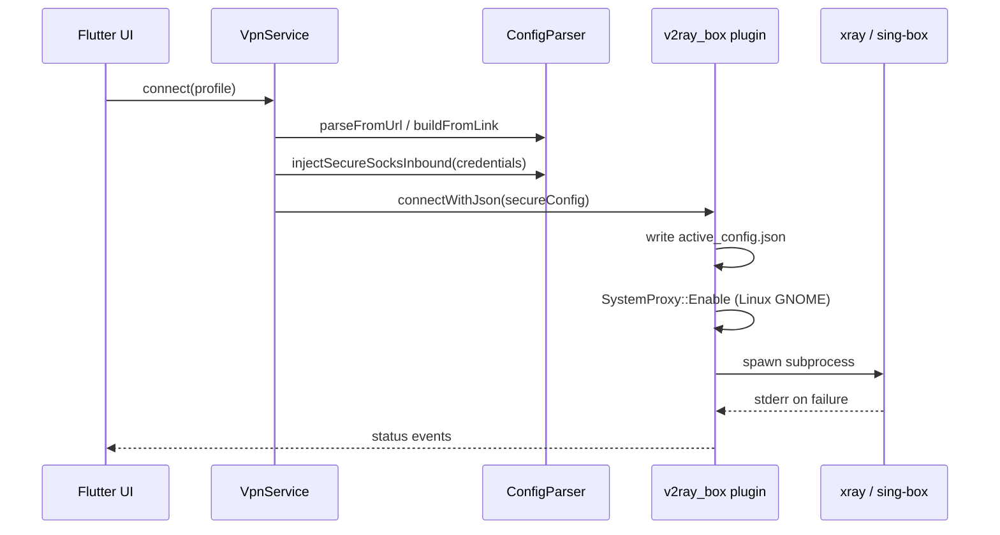

# Архитектура

[← Оглавление документации](README.md) · [English](../en/architecture.md)

## Поток верхнего уровня



## Flutter-приложение (`secure_vpn_client`)

### Управление состоянием

- **Riverpod** — `vpn_providers.dart`
  - `vpnServiceProvider`, `engineProvider`, `profilesProvider`, `selectedProfileProvider`
  - Профили сохраняются через `shared_preferences`

### Слой безопасности (Dart)

1. **`CredentialService`** — CSPRNG логин/пароль на сессию (`crypto_utils.dart`).
2. **`ConfigParser.injectSecureSocksInbound()`** — удаляет небезопасные SOCKS inbound, добавляет SOCKS с auth на `127.0.0.1:1080`; при `proxyOnly: true` (desktop) также добавляет HTTP inbound на `socksPort + 1` (по умолчанию `1081`) с теми же сессионными учётными данными для системного прокси GNOME.
3. **Обработка подписок в `ConfigParser`** — выбор User-Agent, пропуск decoy, разбор JSON-массива v2rayNG, миграция DNS sing-box, удаление VPN-only inbound на desktop.
4. **`LinkConfigBuilder`** — минимальный JSON xray/sing-box из share-ссылок (`vless://`, `vmess://`, `trojan://`, `ss://`).

### VpnService

- `initialize()` — на desktop выставляет `VpnMode.proxy`, `enableTun: false` в `ConfigOptions`.
- `resolveProfileConfig()` — URL подписки → нормализованная ссылка или JSON; config link → `LinkConfigBuilder`.
- `connect()` — inject secure inbound → `checkConfigJson` → канал credentials → `connectWithJson`.

## Форк v2ray_box (`packages/v2ray_box`)

Path-зависимость в `secure_vpn_client/pubspec.yaml`:

```yaml
v2ray_box:
  path: ../packages/v2ray_box
```

### Linux desktop plugin

| Файл | Роль |
|------|------|
| `linux/v2ray_box_plugin.cc` | Method channel `v2ray_box`, канал credentials `secure_vpn/credentials`; `SystemProxy::Enable`/`Disable` на start/stop |
| `linux/desktop_core.cc` | FindBinary, Start/Stop subprocess, копирование geo, stderr, очистка orphan-процессов на портах 1080/1081 |
| `linux/desktop_core.h` | Общие хелперы (пути, WriteTextFile, EnsureXrayGeoAssets) |
| `linux/system_proxy.cc` | Backup/restore GNOME GSettings; HTTP-прокси `127.0.0.1:1081` с сессионным auth |
| `linux/native_messaging.cc` | Установка native host + манифестов браузера; публикация сессионных creds для расширения |
| `linux/native_messaging_host.cc` | Standalone stdio host (`secure_vpn_native_host`) для расширения Chrome/Firefox |
| `extensions/secure-vpn-proxy-auth/` | Расширение браузера: `onAuthRequired` + native messaging |

**Пути во время работы:**

- Рабочий каталог: `~/.local/share/v2ray_box/`
- Активный конфиг: `~/.local/share/v2ray_box/profiles/active_config.json`
- Geo Xray: `~/.local/share/v2ray_box/assets/{geoip,geosite}.dat`
- Ядра в бандле: `{app_bundle}/lib/resources/{xray,sing-box}`

**Переменные окружения (дочерний процесс):**

- `XRAY_LOCATION_ASSET` → каталог assets
- `SECURE_VPN_SOCKS_USER`, `SECURE_VPN_SOCKS_PASS`, `SECURE_VPN_SOCKS_PORT`

### Android / iOS / macOS

В форке — плагины credentials и сборщики конфигов. Android: `VpnService` / `BoxService`; iOS/macOS: Swift `ConfigBuilder` + обёртки процессов.

## Форматы конфигов

### Xray (подписка через UA v2rayNG)

Сервер отдаёт JSON-**массив** конфигов. Первый реальный entry содержит outbound `vless`/`vmess`/`trojan`. Routing может использовать `geosite:` / `geoip:` → нужны geo `.dat`.

Плейсхолдер `outboundTag: "proxy"` переписывается на реальный tag outbound в `ConfigParser`.

### sing-box (подписка через UA `sing-box`)

Сервер отдаёт base64-список **ссылок**. Первая не-decoy `vless://` разбирается `LinkConfigBuilder`.

### Hiddify JSON (избегать на desktop)

User-Agent по умолчанию Dart `http` (`Dart/x.x (dart:io)`) может вернуть полный sing-box JSON с `tun-in` и устаревшим DNS — **не использовать**; в `parseFromUrl` всегда задавайте явный UA.

## Модель безопасности

Desktop proxy mode (Linux):

```
[Browser] --system proxy--> 127.0.0.1:1081 HTTP (нужен auth)
     ^                           ^
     |                           |
[Extension] <--native messaging-- [Flutter app] --> session.json + GSettings
[Other apps] --> 127.0.0.1:1080 SOCKS (нужен auth, те же сессионные creds)
                              |
                    [xray/sing-box] --> remote outbound
```

**Auth обязателен по дизайну** — случайные учётные данные на сессию только на `127.0.0.1`; уничтожение при disconnect. Chromium игнорирует пароли прокси из GSettings; **расширение браузера** отвечает на `407` через native messaging (без неаутентифицированного forwarder).

Уязвимый паттерн, которого мы избегаем:

```
[Любое приложение на LAN/localhost] --> 0.0.0.0:7890 (без auth)  # класс CVE, март 2026
```

Чеклист: [security.md](security.md).
