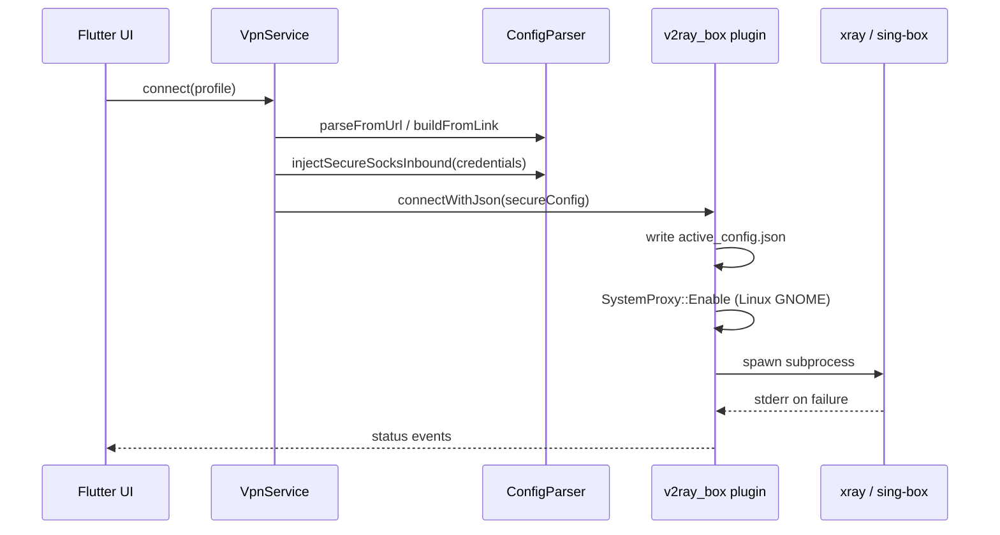

# Архитектура

<p align="right">
  <a href="../en/architecture.md"></a>
</p>


## Общий поток



## Flutter-приложение (`secure_vpn_client`)

### Управление состоянием

- **Riverpod** — `vpn_providers.dart`
  - `vpnServiceProvider`, `engineProvider`, `profilesProvider`, `selectedProfileProvider`
  - Профили сохраняются через `shared_preferences`

### Слой безопасности (Dart)

1. **`CredentialService`** — CSPRNG username/password на сессию (`crypto_utils.dart`).
2. **`ConfigParser.injectSecureSocksInbound()`** — удаляет небезопасные SOCKS inbound, добавляет аутентифицированный SOCKS на `127.0.0.1:1080`; при `proxyOnly: true` (desktop) также HTTP inbound на `socksPort + 1` (по умолчанию `1081`) с теми же учётными данными для GNOME.
3. **`ConfigParser` — подписки** — выбор User-Agent, пропуск decoy, парсинг JSON-массива v2rayNG, миграция DNS sing-box, удаление VPN-only inbound на desktop.
4. **`LinkConfigBuilder`** — минимальный JSON xray/sing-box из ссылок (`vless://`, `vmess://`, `trojan://`, `ss://`).

### VpnService

- `initialize()` — на desktop `VpnMode.proxy`, `enableTun: false`.
- `resolveProfileConfig()` — URL подписки → выбранный сервер (`selectedServerIndex`) как ссылка или JSON; config link → `LinkConfigBuilder`.
- `connect()` — secure inbound → `checkConfigJson` → credentials channel → `connectWithJson`.

## Форк v2ray_box (`packages/v2ray_box`)

Path dependency в `secure_vpn_client/pubspec.yaml`:

```yaml
v2ray_box:
  path: ../packages/v2ray_box
```

### Linux desktop plugin

| Файл | Роль |
|------|------|
| `linux/v2ray_box_plugin.cc` | Method channel `v2ray_box`, credentials channel `secure_vpn/credentials`; `SystemProxy::Enable`/`Disable` |
| `linux/desktop_core.cc` | FindBinary, Start/Stop subprocess, geo assets, stderr, cleanup портов 1080/1081 |
| `linux/system_proxy.cc` | GNOME GSettings; HTTP прокси `127.0.0.1:1081` с auth |
| `linux/native_messaging.cc` | Native host + manifests для расширения |
| `extensions/secure-vpn-proxy-auth/` | Расширение браузера: `onAuthRequired` + native messaging |

**Пути runtime:**

- Рабочая директория: `~/.local/share/v2ray_box/`
- Активный конфиг: `~/.local/share/v2ray_box/profiles/active_config.json`
- Geo Xray: `~/.local/share/v2ray_box/assets/{geoip,geosite}.dat`
- Ядра в bundle: `{app_bundle}/lib/resources/{xray,sing-box}`

**Переменные окружения (child process):**

- `XRAY_LOCATION_ASSET`
- `SECURE_VPN_SOCKS_USER`, `SECURE_VPN_SOCKS_PASS`, `SECURE_VPN_SOCKS_PORT`

### Android / iOS / macOS

Форк включает secure credential plugins и config builders. Android — `VpnService` / `BoxService`; iOS/macOS — Swift `ConfigBuilder` + process wrappers.

## Форматы конфигурации

### Xray (подписка через UA v2rayNG)

Сервер возвращает JSON **массив** конфигов. Первый реальный entry содержит outbound `vless`/`vmess`/`trojan`. Routing может использовать `geosite:` / `geoip:` → нужны geo `.dat`.

Placeholder `outboundTag: "proxy"` переписывается в `ConfigParser`.

### sing-box (подписка через UA `sing-box`)

Сервер возвращает base64 **список ссылок**. Первая не-decoy `vless://` парсится `LinkConfigBuilder`.

### Hiddify JSON (избегать на desktop)

User-Agent `Dart/x.x (dart:io)` может вернуть полный sing-box JSON с `tun-in` и legacy DNS — **не использовать**; всегда явный UA в `parseFromUrl`.

## Модель безопасности (desktop proxy mode)

```
[Браузер] --системный прокси--> 127.0.0.1:1081 HTTP (auth)
     ^                              ^
     |                              |
[Расширение] <--native messaging-- [Flutter] --> session.json + GSettings
[Другие apps] --> 127.0.0.1:1080 SOCKS (auth, те же creds)
                              |
                    [xray/sing-box] --> remote outbound
```

Auth обязателен по дизайну — случайные учётные данные на `127.0.0.1`, стирание при disconnect. Chromium игнорирует пароли GSettings; **расширение браузера** отвечает на `407` через native messaging.

Уязвимый паттерн, который мы исключаем:

```
[Любое app на LAN/localhost] --> 0.0.0.0:7890 (без auth)  # класс CVE, март 2026
```

См. [security.md](security.md).
